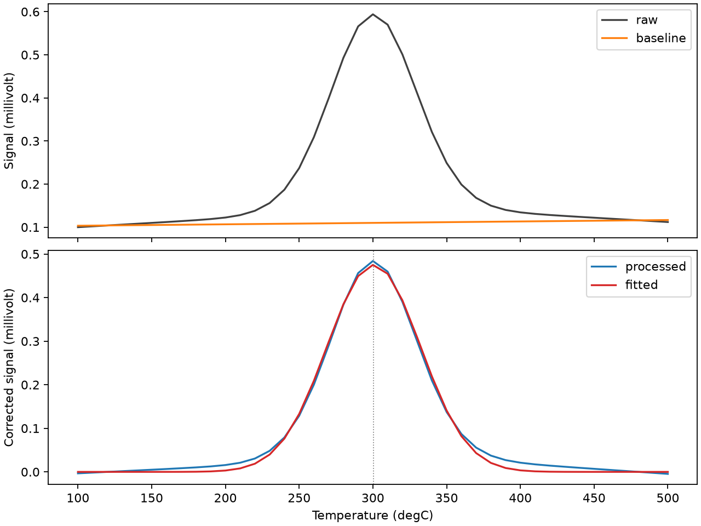

# TPxLab

> Reproducible analysis of temperature-programmed catalyst characterization data.

[](https://github.com/hdkim99/TPxLab/actions/workflows/ci.yml)
[](https://www.python.org/)
[](LICENSE)

TPxLab turns CSV/XLSX TPR, TPD, and TPO curves into inspectable baseline corrections,
editable peak models, coordinate-aware integrals, unit-checked quantities, plots, and
reproducible exports. The same `AnalysisService` powers its Python API, CLI, and GUI.



## Install

```bash
python -m pip install tpxlab
```

For a source checkout:

```bash
python -m pip install -e .
```

## 30-second quickstart

```bash
tpxlab analyze examples/synthetic_tpr.csv \
  --output examples/output/analysis.xlsx \
  --figure examples/output/analysis.png \
  --baseline linear --prominence 0.1 --peak-center 300

tpxlab-gui
```

The GUI follows: load → map columns/units → baseline/detect → edit peak centers/bounds
→ fit/quantify → export. Quantification is enabled only when calibration value/unit and
sample mass value/unit are all provided.

## Python API

```python
from tpxlab import AnalysisService, AnalysisSettings
from tpxlab.io import load_raw_data

raw = load_raw_data("examples/synthetic_tpr.csv")
result = AnalysisService().analyze(
    raw,
    AnalysisSettings(baseline_method="linear", peak_prominence=0.1),
)
print(result.fits[0].center, result.integrated_peaks[0].area)
```

## Support status in v0.1.0

| Capability | Status | Notes |
|---|---|---|
| CSV and XLSX import | Supported | explicit or conservative automatic 3-column mapping |
| Linear, polynomial, ALS baseline | Supported | raw data is never overwritten |
| Optional Savitzky-Golay smoothing | Supported | parameters exported |
| Peak detection and manual edits | Supported | positive peaks; center/bounds editable |
| Gaussian/Lorentzian/Voigt fit | Supported | independent bounded regions, not overlapping deconvolution |
| Trapezoid/Simpson integration | Supported | actual time coordinates, including irregular sampling |
| Calibration + sample-mass quantification | Supported | Pint dimensional validation |
| Explicit reduction degree | Experimental | API only; user supplies stoichiometry |
| TPSR and pulse chemisorption workflows | Planned | not implemented |
| Overlapping multi-peak deconvolution | Planned | not implemented |

## Outputs

An XLSX workbook contains Raw, Processed, Peaks, Settings, Metadata, and QC sheets. A
directory destination writes the same layers as CSV. Peak rows include Tmax, fit area,
height, FWHM, numerical signal-time area, fit parameters, uncertainties, covariance,
fit statistics, and optional amount/mass. PNG/SVG/PDF figures are available via
`--figure` based on the chosen filename.

## Scientific scope and limitations

- Peak fit area is with respect to temperature; calibrated detector integration is with
  respect to time. They are labeled separately in exports.
- Baseline choice is an analytical assumption and must be visually reviewed.
- v0.1 analyzes positive peaks in independent regions and does not infer chemistry.
- A non-monotonic temperature program is flagged; temperature bounds may select more
  than one pass through a repeated temperature range, so users must review such data.

Definitions, equations, and validation details are in
[Scientific methods](docs/scientific-methods.md). The provisional public export contract
is described in [Interchange metadata](docs/interchange.md).

## Development

```bash
python -m pip install -e '.[dev]'
ruff check .
mypy src
pytest
python -m build
```

Runtime dependencies use permissive licenses compatible with MIT: NumPy/SciPy/pandas
(BSD), Pint (BSD), Matplotlib (PSF-based), and openpyxl (MIT). See `pyproject.toml` for
the complete declared dependency set and [CONTRIBUTING.md](CONTRIBUTING.md) for policy.

